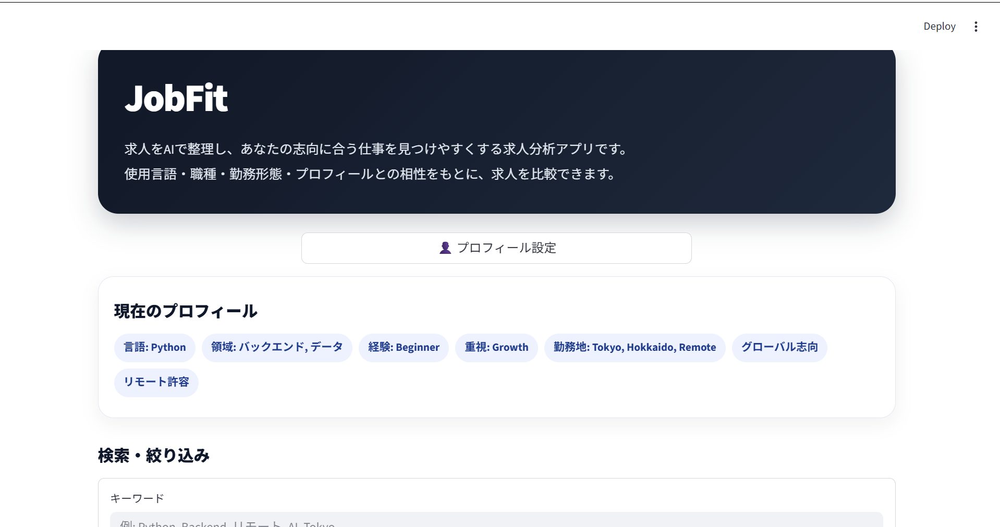
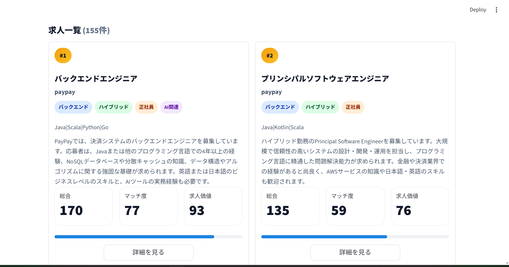
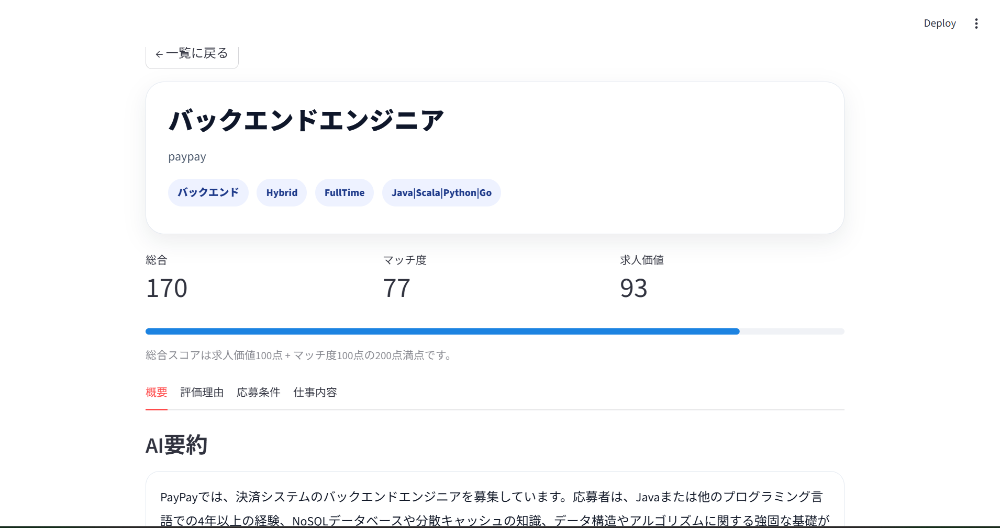
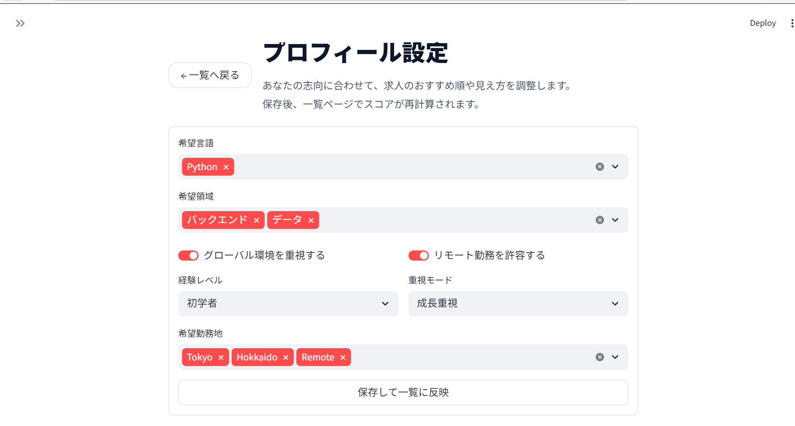

# JobFit Mode A

AIを活用して求人情報を分析・可視化する、求人分析Webアプリです。
モードAでは
JobFitは、求人ページをスクレイピングし、
AIによる要約・翻訳・分類・スコアリングを行い、
ユーザーのプロフィールに応じて求人とのマッチ度を可視化します。

---

# Live Demo

https://YOUR-STREAMLIT-URL.streamlit.app

---

# Screenshots

## Home



## Job List



## Job Detail



## Profile Settings



---

# Features

- 求人情報スクレイピング
- AI要約
- AI翻訳
- 技術タグ抽出
- 求人カテゴリ分類
- 求人価値スコアリング
- プロフィールベースのマッチ度計算
- キーワード検索
- 職種・勤務形態・雇用形態フィルタ
- StreamlitでのWeb UI

---

# Tech Stack

## Frontend

- Streamlit
- css

## Backend / Data Processing

- Python
- pandas
- requests
- BeautifulSoup

## AI

- OpenAI API

## Infrastructure

- Streamlit Community Cloud

---

# System Architecture

```text
fetch_list
    ↓
fetch_detail
    ↓
build_dataset
    ↓
summarize
    ↓
translate
    ↓
classify
    ↓
score
    ↓
Streamlit UI
```

---

# Project Structure

```text
job_scraper/
├── streamlit_app.py
├── src/
│   ├── app.py
│   ├── cli.py
│   ├── user_profile.py
│   ├── analysis/
│   │   └── ai/
│   │       ├── summarize.py
│   │       ├── translate.py
│   │       ├── classify.py
│   │       └── score.py
│   ├── pages/
│   │   ├── job_detail.py
│   │   └── profile_settings.py
│   └── pipeline/
│
├── data/
│   ├── raw/
│   └── output/
│
└── README.md
```

---

# Key Design Decisions

## 1. Separation of Responsibilities

Each processing stage is separated into independent modules:

- collection
- analysis
- classification
- scoring
- UI

This structure makes the pipeline easier to extend and maintain.

---

## 2. Dynamic Profile-Based Rescoring

JobFit recalculates fit scores dynamically
based on user profile settings without rebuilding datasets.

This enables fast UI-side personalization.

---

## 3. Preprocessed Dataset Architecture (Mode A)

Mode A focuses on:

- preprocessing large job datasets
- fast UI filtering
- lightweight deployment

instead of realtime scraping.

This design prioritizes usability and responsiveness.

---

# Supported Data Source

Currently optimized for:

- Greenhouse job boards

Example:

```text
https://job-boards.greenhouse.io/paypay
```

---

# Local Setup

## Clone Repository

```bash
git clone https://github.com/kentyon67/job_scraper.git
cd job_scraper
```

## Install Dependencies

```bash
pip install -r requirements.txt
```

## Set OpenAI API Key

```bash
OPENAI_API_KEY=your_api_key
```

## Run Pipeline

```bash
python -m src.cli pipeline --mode full
```

## Run App

```bash
streamlit run streamlit_app.py
```

---

# Future Improvements (Mode B)

Planned extensions:

- FastAPI backend
- Database integration
- Realtime job search
- Automatic scheduled updates
- Multi-source job board support
- API-based search architecture

---

# Author

Kensei Ogura

GitHub:
https://github.com/kentyon67